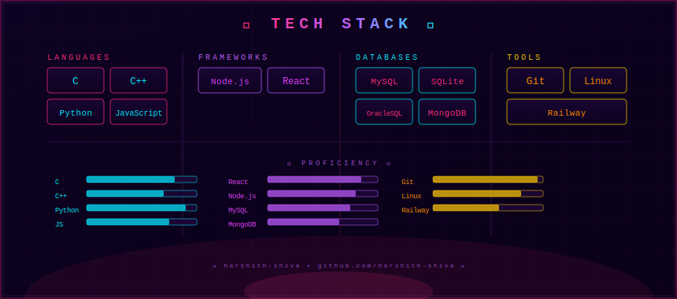

<!-- ═══════════════════════════════════════════════════════════════ -->
<!--                   [ HERO BANNER — YOUR GIF HERE ]             -->
<!-- ═══════════════════════════════════════════════════════════════ -->
<!-- 
  HOW TO ADD YOUR GIF:
  1. Upload your gif to this repo (e.g., banner.gif)
  2. Replace the img src below with the raw URL or relative path
  Replace this block with your own gif:
-->

<div align="center">

<!-- ▼ REPLACE THE SRC WITH YOUR OWN GIF PATH ▼ -->

<!-- Tip: For a local gif in your repo, use:  -->

<br/>

<!-- Typing SVG — animated neon tagline -->
[](https://git.io/typing-svg)

<br/>

<!-- Profile view counter -->

&nbsp;
[](https://github.com/harshith-shiva?tab=followers)

</div>

<br/>

---

<!-- ═══════════════════════════════════════════════════════════════ -->
<!--                        ABOUT ME                               -->
<!-- ═══════════════════════════════════════════════════════════════ -->

<div align="center">

</div>

<br/>

---

<!-- ═══════════════════════════════════════════════════════════════ -->
<!--                     TECH STACK WALL                           -->
<!-- ═══════════════════════════════════════════════════════════════ -->

<div align="center">


<!--
  HOW TO USE THE CUSTOM SYNTHWAVE SVG:
  1. Copy the file `techstack.svg` from this repo into your profile repo root
  2. Then the line below will render it perfectly
  3. OR paste the raw GitHub URL once you've pushed it
-->



</div>

<br/>

---

<!-- ═══════════════════════════════════════════════════════════════ -->
<!--                    GITHUB STATS                                -->
<!-- ═══════════════════════════════════════════════════════════════ -->

<div align="center">

### ◈ STATS CONSOLE ◈


<br/><br/>


</div>

<br/>

---

<!-- ═══════════════════════════════════════════════════════════════ -->
<!--                     ACTIVITY GRAPH                            -->
<!-- ═══════════════════════════════════════════════════════════════ -->

<div align="center">

### ◈ ACTIVITY GRID ◈

[](https://github.com/ashutosh00710/github-readme-activity-graph)

</div>

<br/>

---

<!-- ═══════════════════════════════════════════════════════════════ -->
<!--                       GUEST BOOK                              -->
<!-- ═══════════════════════════════════════════════════════════════ -->

<div align="center">

### ◈ GUEST BOOK ◈

```
                                             ❤️ DROP A MESSAGE ❤️
```

<!--
  HOW THE GUESTBOOK WORKS:
  - When someone clicks the banner below, they land on your repo's Issues tab
  - They click "New Issue" and leave a message — that IS the guestbook
  - It's how fnky does it: zero backend, free forever, GitHub-native
  - After pushing this README to your profile repo, the link below works automatically
-->

[](https://github.com/harshith-shiva/harshith-shiva/issues/new?assignees=harshith-shiva&labels=guestbook&title=%F0%9F%8C%90+Visitor+Entry+%7C+%5BYour+Name%5D&body=%23+Hey+Harshith%21%0A%0A%3C!--+Tell+him+something+--%3E%0A%0A%2A%2AFrom%3A%2A%2A+%5Byour+name%5D%0A%2A%2AMessage%3A%2A%2A+%0A%0A---%0A*Signed+via+the+Guestbook+%E2%9A%A1*)

[](https://github.com/harshith-shiva/harshith-shiva/issues?q=label%3Aguestbook)

</div>

<br/>

---

<!-- ═══════════════════════════════════════════════════════════════ -->
<!--                      CONNECT                                   -->
<!-- ═══════════════════════════════════════════════════════════════ -->

<div align="center">

### ◈ OPEN CHANNELS ◈

[](https://github.com/harshith-shiva)
&nbsp;
[](https://linkedin.com/in/harshith-shiva)
&nbsp;
[](mailto:your@email.com)

<br/>

```
```

</div>
