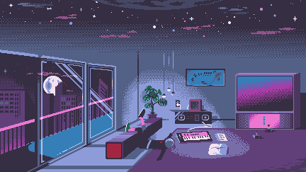

<!-- 
 -->

 

# Hey there ㋡

 

## About Me 💬

<table>
<tr>
<td width="60%" valign="top">

- 🎓 Computer Science student, always building something
- 🛠️ I like turning weird little ideas into working tools — a story generator, a Chrome extension, a Telegram bot, a network simulator
- 🌐 Comfortable across the stack — from C/C++ fundamentals to React on the frontend and SQL/NoSQL on the backend
- 🎨 Into clean, intentional design — currently building a portfolio site on the side
- 📫 Always open to interesting projects, collabs, or just a good technical conversation

</td>
<td width="40%" valign="top" align="center">

</td>
</tr>
</table>

 

## Languages & Tools 🛠️

 

## GitHub Stats 📊

 

## Sign my guestbook ✍️

Drop a message — say hi, leave feedback, or just sign in.

&nbsp;

 

## Reach Me 📬

  

## My Contribution Graph 🎮

<picture>
  <source media="(prefers-color-scheme: dark)" srcset="https://raw.githubusercontent.com/harshith-shiva/harshith-shiva/output/pacman-contribution-graph-dark.svg">
  <source media="(prefers-color-scheme: light)" srcset="https://raw.githubusercontent.com/harshith-shiva/harshith-shiva/output/pacman-contribution-graph.svg">
  
</picture>
